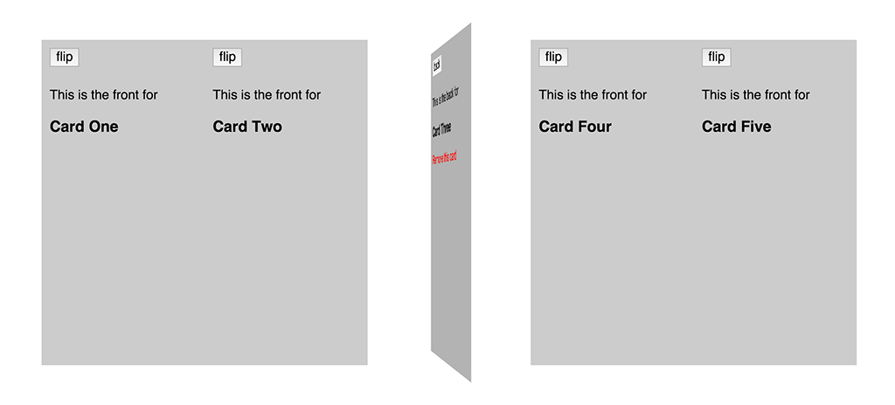

# React Flipper

An example implementation of a "card flip" effect using React components.

## Why?

The idea was to have "cards" of content in an array or grid which could "flip"
such that the backs of each card could contain settings controls for the content
presented on their fronts. This seemed an intuitive metaphor to communicate the
connection between the settings switches and toggles with the content that they
affect.

That said, I noticed some weird behaviour when using React to do the rendering.
Sometimes when I removed an element from the app, strange side-effects would
happen such as the card after the removed card would appear flipped (because
the "flipped" class from the previous occupant of that spot remained). As well,
in different circumstances a strange merging of the removed and after-removed
components would occur whereby the back of the removed component would remain
whilst the front of the after-removed component would now be on the front.

## The key is the key

After banging my head into transition groups and css transforms and virtual doms
and regular doms I eventually realized that the "key" attribute being used on
the dynamically created containers for each card wasn't changing and that this
was causing the strange side-effects I was seeing.

For example, I was iterating over an array of card content and creating a series
of Flipper components inside a container element (in this example, an `<li>`).
I was applying a `key` attribute to each containing `<li>` element, but was
lazilly just supplying the index of the element in the content array. As such,
when I removed an element from the content array, the content that appeared
after the content that was deleted, would end up, now, taking over the `key`
value of the deleted content, and this caused issues with how React rendered
the screen.

Take an array of content `['one', 'two', 'three']` each rendering a series of
components wrapped in `<li>` tags. Each `<li>` was given the index of each
element in the array such that `<li key=0>`, `<li key=1>`, and `<li key=2>`
would be output. Now, when I removed the element for the content with "two",
the output for the newly rendered component for content with "three" was now
being wrapped in an li with `key=1` (previous occupied spot of content "two").
This ended up mixing the two real DOM elements up.

To fix the issue, I simply ensured that each key was unique to its content. In
this simple example, I simply merged the array index along with the component's
name such as `key=CardOne0` and `key=CardTwo1` and `key=CardThree2`. This way,
when Card Two was deleted, CardThree's key would knock out the old one and
render properly.

## TL;DR

Make sure the keys you use to render dynamic content in React are unique to the
components being rendered (not the array position; especially if components
will be changing array positions).
